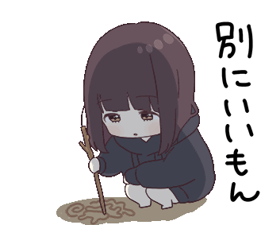

<p align="center">
  
</p>

<p align="center">
  <a href="https://git.io/typing-svg">
  </a>
</p>

<p align="center">
  
</p>

#  About us;

```sh
root@anto426-project: ~/org_readme (main⚡)$ neofetch

⡿⣡⣿⣿⡟⡼⡁⠁⣰⠂⡾⠉⢨⣿⠃⣿⡿⠍⣾⣟⢤⣿⢇⣿⢇⣿⣿⢿            root@anto426-project
⣱⣿⣿⡟⡐⣰⣧⡷⣿⣴⣧⣤⣼⣯⢸⡿⠁⣰⠟⢀⣼⠏⣲⠏⢸⣿⡟⣿            --------------------
⣿⣿⡟⠁⠄⠟⣁⠄⢡⣿⣿⣿⣿⣿⣿⣦⣼⢟⢀⡼⠃⡹⠃⡀⢸⡿⢸⣿            OS: AntoOS Server
⣿⣿⠃⠄⢀⣾⠋⠓⢰⣿⣿⣿⣿⣿⣿⠿⣿⣿⣾⣅⢔⣕⡇⡇⡼⢁⣿⣿            Host: Anto426-Project Server
⣿⡟⠄⠄⣾⣇⠷⣢⣿⣿⣿⣿⣿⣿⣿⣭⣀⡈⠙⢿⣿⣿⡇⡧⢁⣾⣿⣿            Uptime: 2OY
⣿⡇⠄⣼⣿⣿⣿⣿⣿⣿⣿⣿⣿⣿⣿⠟⢻⠇⠄⠄⢿⣿⡇⢡⣾⣿⣿⣿            Shellv: 20.0
⣿⣷⢰⣿⣿⣾⣿⣿⣿⣿⣿⣿⣿⣿⣿⢰⣧⣀⡄⢀⠘⡿⣰⣿⣿⣿⣿⣿            OrgName: Anto426-Project
⢹⣿⢸⣿⣿⠟⠻⢿⣿⣿⣿⣿⣿⣿⣿⣶⣭⣉⣤⣿⢈⣼⣿⣿⣿⣿⣿⣿            Type: Development Hub
⢸⠇⡜⣿⡟⠄⠄⠄⠈⠙⣿⣿⣿⣿⣿⣿⣿⣿⠟⣱⣻⣿⣿⣿⣿⣿⠟⠁            Location: Italy
⠄⣰⡗⠹⣿⣄⠄⠄⠄⢀⣿⣿⣿⣿⣿⣿⠟⣅⣥⣿⣿⣿⣿⠿⠋⠄⠄⣾            Focus: UniApp, Antobot, Backend Systems
⠜⠋⢠⣷⢻⣿⣿⣶⣾⣿⣿⣿⣿⠿⣛⣥⣾⣿⠿⠟⠛⠉⠄⠄ . .
```

<p align="center">
  
</p>

#  Technologies;

```sh
root@anto426-project: ~/org_readme (main⚡)$ skill --list

> main_stack:
  - JavaScript / TypeScript (Node.js)
  - Java / Kotlin
  - Python
  - C / C++
  - SQL (MySQL)

> infrastructure:
  - Docker & Containers
  - Linux Servers
  - GitHub Actions (CI/CD)

> projects:
  - Uniapp (Mobile Client)
  - UniappServer (Backend)
  - Antobot (Discord Bot)
```

<p align="center">
  
</p>

#  Statistics;

<p align="center">
  
</p>

#  Visitors;

<icon>
<p align="center">
  
</p>

<p align="center">
  
</p>
